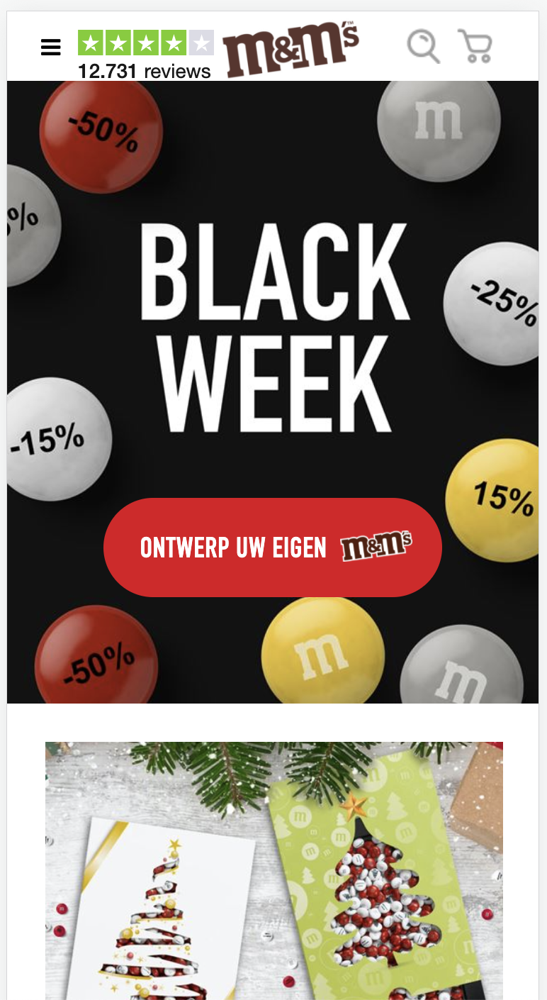
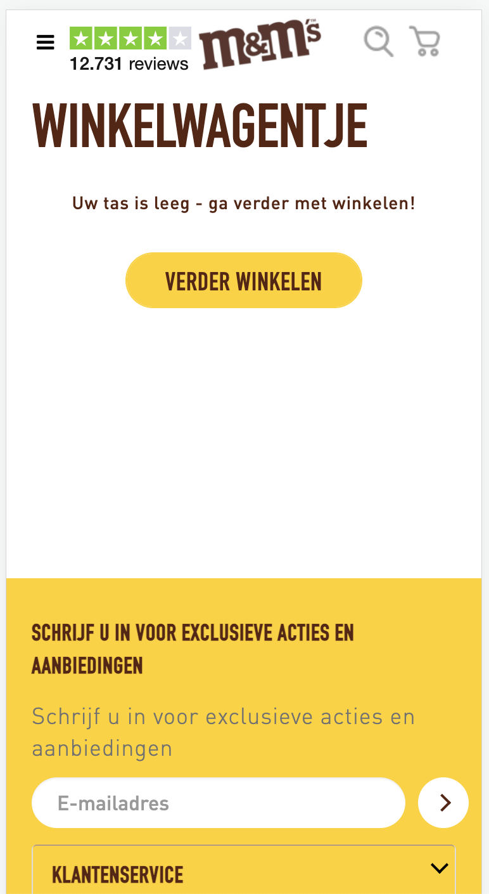
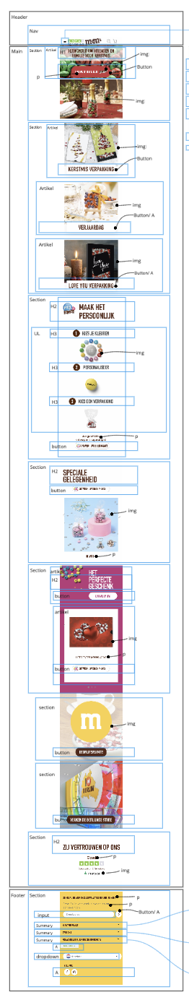
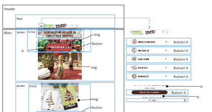
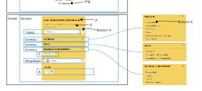
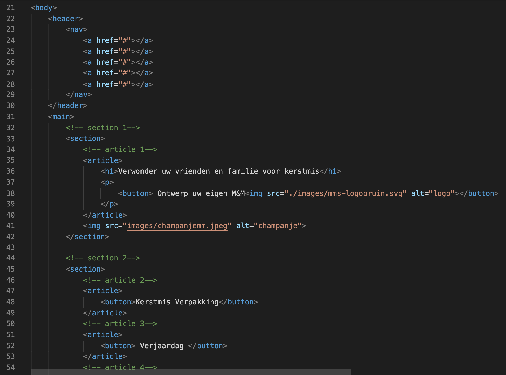
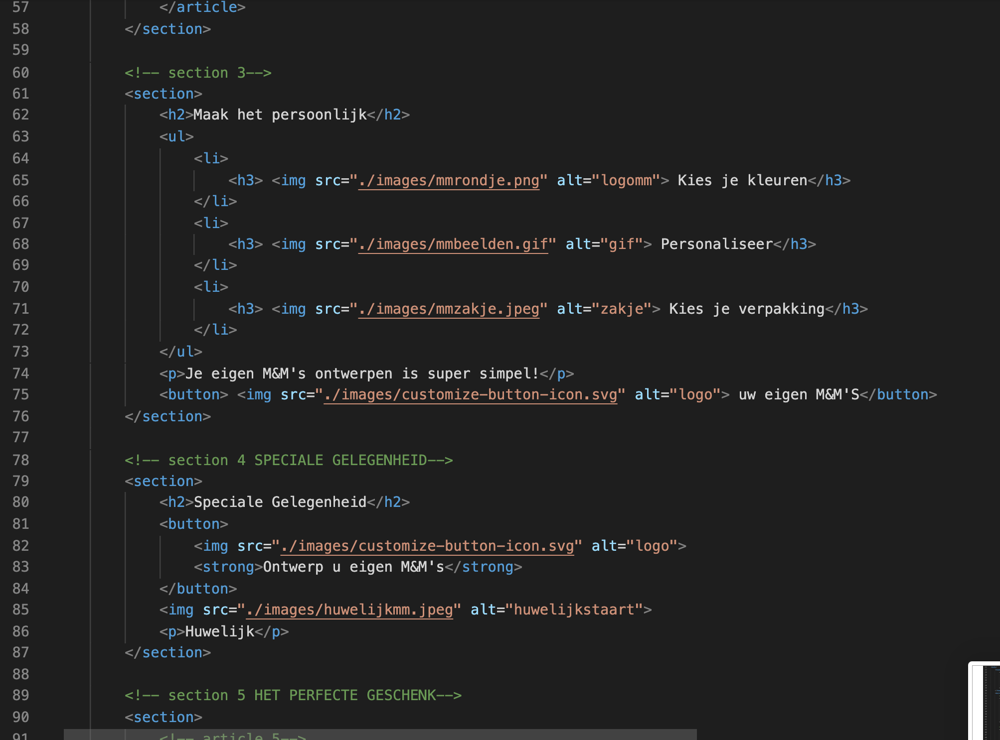
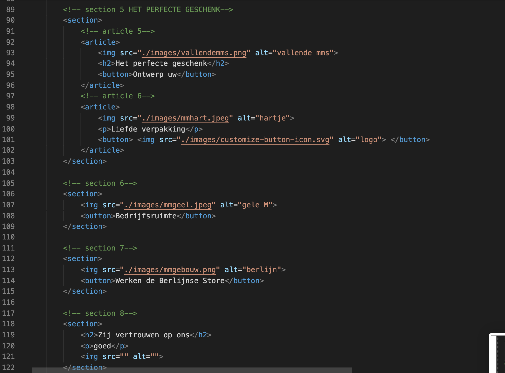

# Procesverslag
Markdown is een simpele manier om HTML te schrijven.  
Markdown cheat cheet: [Hulp bij het schrijven van Markdown](https://github.com/adam-p/markdown-here/wiki/Markdown-Cheatsheet).

Nb. De standaardstructuur en de spartaanse opmaak van de README.md zijn helemaal prima. Het gaat om de inhoud van je procesverslag. Besteedt de tijd voor pracht en praal aan je website.

Nb. Door *open* toe te voegen aan een *details* element kun je deze standaard open zetten. Fijn om dat steeds voor de relevante stuk(ken) te doen.

## Jij

uitwerken voor kick-off werkgroep

### Auteur:
Isabelle van Huystee - 500852575
 
#### Je startniveau:
Blauwe piste
 
#### Je focus:
Surface plane
 

## Je website

uitwerken voor kick-off werkgroep

### Je opdracht:
https://www.mms.com/nl-nl/
 
#### Screenshot(s) van de eerste pagina (small screen): 
hier de naam van de pagina  

#### Screenshot(s) van de tweede pagina (small screen):
hier de naam van de pagina  

 

## Breakdownschets (week 1)

uitwerken na afloop 2e werkgroep

### de hele pagina: 

### dynamisch deel (bijv menu): 

### wellicht nog een dynamisch deel (bijv filter): 

## Voortgang 1 (week 2)

uitwerken voor 1e voortgang

### Stand van zaken
Bij het opstarten van het coderen ging het even wat moeilijk, maar nu ik eenmaal bezig ben denk ik dat het wel goed komt. Hieronder afbeeldingen van mn huidige website en code.

### Agenda voor meeting
Ieder elkaar de ruimte geven om zijn/haar vragen te laten stellen.

### student 1 Rebecca 
 - Hoe ik het beste een logo in de Header zet.
 - Hoe ik de P en H1 in een section kan aanpassen.
 - Waarom de pagina niet verder wil scrollen.
### student 2 Beyza          
 -
### student 3 Ik                                       
 - Hoe ik het beste een img over een img kan zetten.
 - Hoe ik het beste een indeling kan maken voor mijn verschillende buttons.
### student 4 Daan
 - Hoe de animatie infade op mijn site zet.

### Verslag van meeting
We hebben goed gekeken naar mijn basiswebsite en mijn vragen, daar kwamen de volgende punten uit:
- De structuur van mijn HTML en CSS is erg netjes.
- Ik ben goed opweg. 
- Uitleg gekregen over hoe ik het beste twee verschillende image over elkaar heen kan plaatsen. 
- Dat ik het beste nog specifieker kan zijn in het aanroepen in mijn CSS om zo verwarring te voorkomen. 

## Voortgang 2 (week 3)

uitwerken voor 2e voortgang

### Stand van zaken
Afgelopen week heb ik veel gewerkt. De Basiswebsite is dan ook voor 90% klaar, het enige waar ik nog even naar moet kijken is het Hamburger Menu en de Footer. Hier was ik wel al mee begonnen, maar dat liep nog niet helemaal lekker. 

### Agenda voor meeting
We lopen in het groepje allemaal nog tegen het openen en sluiten van het hamburger menu aan. Dit wordt dus het hoofd onderwerp van het feedback moment, daarnaast kunnen we altijd nog onze kleine vragen stellen.

### student 1 Rebecca 
 -  Hoe spreek ik een article in een section aan in de footer zonder de code van de daarvoor aangesproken article in section te krijgen?
### student 2 Beyza 
 -
### student 3 Ik 
 - Hoe kan ik het beste mijn hamburger menu uitklappen? 
 - Waarom schaalt deze afbeelding niet mee naar 'center' als ik wel hetzelfde heb gecodeerd als de andere? - regel 205
### student 4 Daan
- Hoe kan ik mijn menu button laten animeren?
- Hoe kan er voorzorgen dat de menu knop bovenaan staat

### Verslag van meeting
- Hoe ik het beste kon werken met mijn hamburger menu. 
- Dat ik vast kan gaan nadenken over welke 5 onderdelen ik wil gaan verwerken in mijn website pagina's om zo aan de minimum 5 onderdelen te komen voor de Surface plane.
- Dat mijn website er netjes uit ziet en ik heel goed bezig ben.
- Dat ik eerst moet gaan beginnen met het bouwen van de tweede pagina, daarna pas de speciale onderdelen moet gaan toevoegen aan beide pagina's.

## Toegankelijkheidstest (week 4)

uitwerken na test in 8e voortgang

### Bevindingen
Lijst met je bevindingen die in de test naar voren kwamen:
 - Voice Over
 - Door website heen gaan met toetsenbord dmv tab
 - 

#### De Voice Over leest niet alle elementen voor op de website
De H1, p en atjes leest de Voice Over niet allemaal voor, in het menu leest die wel alle elementen voor, maar door de website zelf allemaal. 
 
Dit zou ik kunnen aanpassen door andere instellingen te geven aan de voice over. 

#### Door de website heen met het Keyboard 
Het openen en dichtdoen van de menu kan goed, je doet dit dmv van aanklikken van de knop met de spatie. Het gaat alleen wel met een omweg, je zal helemaal terug moeten tabben om bij de knop te komen.
 
Als oplossing zou ik een shortcut kunnen maken voor het open en dichtklappen voor het menu. 

 
#### Zicht beperkingen 
Tijdens de les heb ik 3 verschillende brillen getest. Een waarvan de kleuren op de website worden getest"Color #0779P", een waarmee het zicht volledig wazig wordt en eentje waarbij de rechterkant kan je zicht verdwijnt. Persoonlijk merkte ik alleen moeilijk heden bij de bril waatbij je zicht volledig wazig wordt.
Hier nog afbeeldingen over hoe je de website ziet door de bril:

De kleuren beperking is goed te doen met mijn website, het rechter deel van je zicht verliezen ook, maar met de wazige zicht bril kan je moeilijk de tekst lezen op mijn website. Hier zou ik eventueel de tekstgrootte voor kunnen aanpassen. 

#### Titel nog een bevinding. 
Hier korte omschrijving (met indien nodig een afbeelding)

Hier een omschrijving van hoe het opgelost kan worden (met indien nodig een afbeelding)

## Voortgang 3 (week 4)

uitwerken voor 3e voortgang

### Stand van zaken
hier dit ging goed & dit was lastig (neem ook screenshots op van delen van je website en code)

### Agenda voor meeting
samen met je groepje opstellen

| student 1      | student 2          | student 3    | student 4        |
| ---            | ---                | ---          | ---              |
| dit bespreken  | en dit             | en ik dit    | en dan ik dat    |
| en dat ook nog | dit als er tijd is | nog een punt | dit wil ik zeker |
| ...            | ...                | ...          | ...              |

### Verslag van meeting
hier na afloop snel de uitkomsten van de meeting vastleggen

- punt 1
- punt 2
- nog een punt
- ...

## Eindgesprek (week 5)

uitwerken voor eindgesprek

### Stand van zaken
hier dit ging goed & dit was lastig (neem ook screenshots op van delen van je website en code)

### Screenshot(s)

hier screenshot(s) van je eindresultaat

## Bronnenlijst

continu bijhouden terwijl je werkt

Nb. Wees specifiek ('css-tricks' als bron is bijv. niet specifiek genoeg).

1. bron 1
2. bron 2
3. ...

